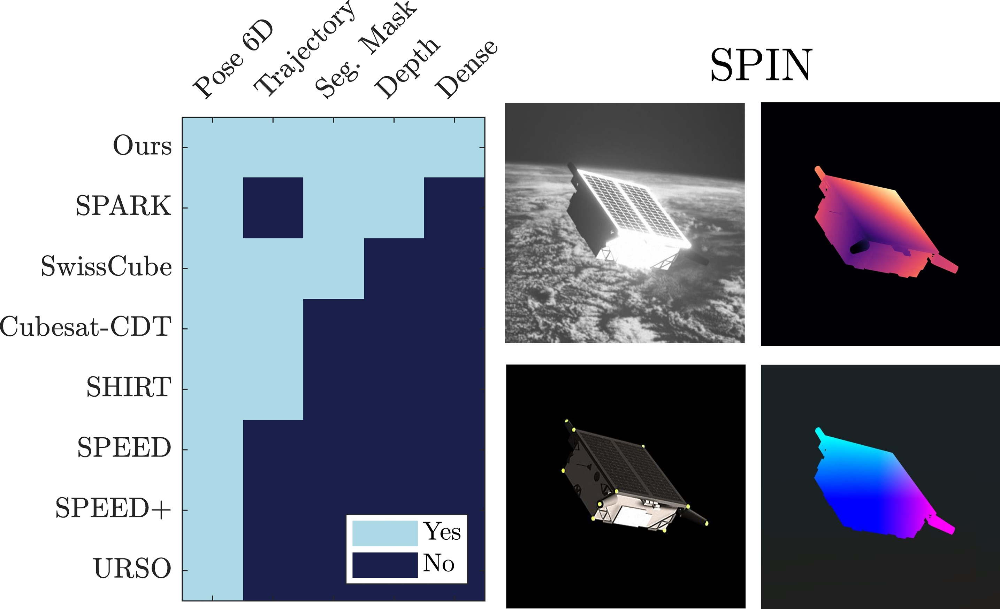

# SPIN: An Open Simulator of Realistic Spacecraft Navigation Imagery

We present SPIN (SPacecraft Imagery for Navigation), a novel open-source realistic spacecraft image generation tool for relative navigation between two spacecrafts. SPIN provides a wide variety of ground-truth data and allows researchers to employ custom 3D models of satellites, define specific camera-relative poses, and adjust various settings such as camera parameters and environmental illumination conditions.

    

  

Code and the full version will be available upon acceptance of our paper.
